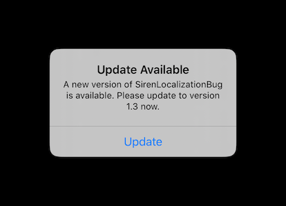

# Siren localization bug

## Bug Description

When running this app, the update alert shows up in English, even though the code uses a presenter with `forceLanguageLocalization` set to `.japanese`:

Specifying string manually in the presenter does work, but this is not ideal: it does not extrapolate the app name and version number in the alertMessage.

## GitHub Issue

https://github.com/ArtSabintsev/Siren/issues/336
